# Exemplo simples de ETL usando Pentaho

Repositório dedicado ao versionamento do processo de ETL utilizado na Aula 2 da disciplina de Business Intelligence e BigData da Especialização de Big Data, Data Science e Data Analytics, da Unisinos.

## Estrutura do projeto

O projeto está organizado como a seguir:

```
├── data
│   └── flight_lite.csv    # Amostra dos dados
├── docker-compose.yml     # Para uso com docker somnente
├── Dockerfile             # Para uso com docker somente
├── dw                     # Saídas das transformações
│   ├── dim_airline.csv
│   ├── dim_airport.csv
│   └── fact_flight.csv
├── README.md              # Documentação (texto)
├── schema.svg             # Documentação (imgagem)
└── src                    # Transformações e job
    ├── dim_airline.ktr
    ├── dim_airport.ktr
    ├── fact_flight.ktr
    └── flights.kjb
```

## Modelagem usada

Os arquivos brutos estão na forma do staging, e DW aqui implementado foi implementado está na forma do exemplo 1, que é o modelo cobrado para implementação na tarefa 2. Já a modelagem teórica cobrada na tabela é compatível com o exemplo 2 (contendo SCD).

